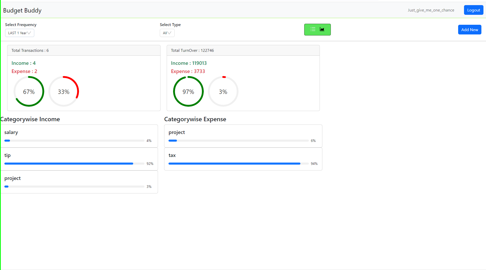

## Important
Because of error to my github i have remove some code and deploy link
# Project overview

# Blog App 2.0

## Overview

Budget Buddy is a full-stack web application designed to help users manage their finances by tracking income and expenses. The application allows users to categorize and analyze their transactions, providing a clear overview of their financial health. This project is built using the MERN (MongoDB, Express, React, Node.js) stack, providing a seamless and responsive experience.

## Features

* **User Authentication**: Secure login and registration using bcrypt for password hashing.

* **Transaction Management**:
  * **Add Transactions**: Users can add income or expense transactions with details such as amount, category, date, and description.
  * **Edit and Delete Transactions**: Transactions can be edited or deleted, allowing users to maintain accurate financial records.
  * **View Transactions**: Users can view a list of all transactions, filtered by time period and type.

* **Analytics**: The app provides analytical insights into spending patterns, helping users make informed financial decisions.

* **Responsive Design**: The application is fully responsive, offering an optimal experience across devices.

  ## Usage

* **Login and Sign Up**: Users must sign up and log in to access the application.

* **Add Transactions**: Use the form to add new transactions, selecting the appropriate type, category, and date.

* **Edit/Delete Transactions**: Modify or remove existing transactions from the list.

* **View Analytics**: Analyze spending habits through graphical representations.


## Installation

### Frontend

1. Open the terminal.
2. Run for frontend:
   ```sh
   npm i
   npm run start start
   
### backend

1. Open the terminal.
2. Run for frontend:
   ```sh
    cd backend
   npm i
   nodemon index.js

## Image
### Register

### Login

### Expense data

### Graph analytic

### Adding

  


